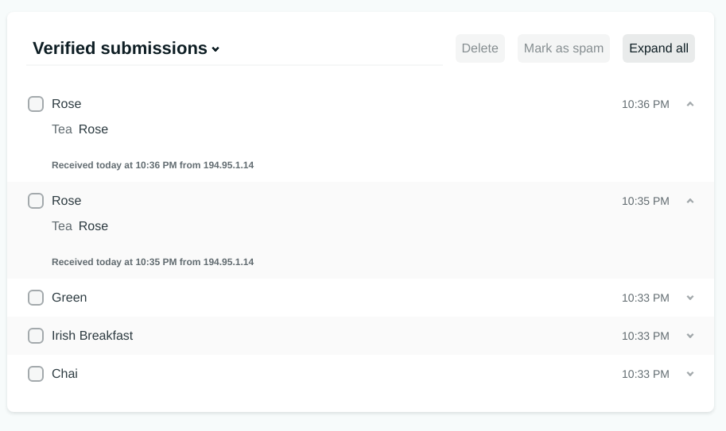

# netlify-nuxt-forms

> Nuxt using Netlify Forms



## Build Setup

``` bash
# install dependencies
$ yarn install

# serve with hot reload at localhost:3000
$ yarn dev

# build for production and launch server
$ yarn build
$ yarn start

# generate static project
$ yarn generate
```


<a href="https://www.buymeacoffee.com/F1j07cV" target="_blank"></a>

 Spread Love :hearts: and not :no_entry_sign: hatred   [](https://twitter.com/avimehenwal)